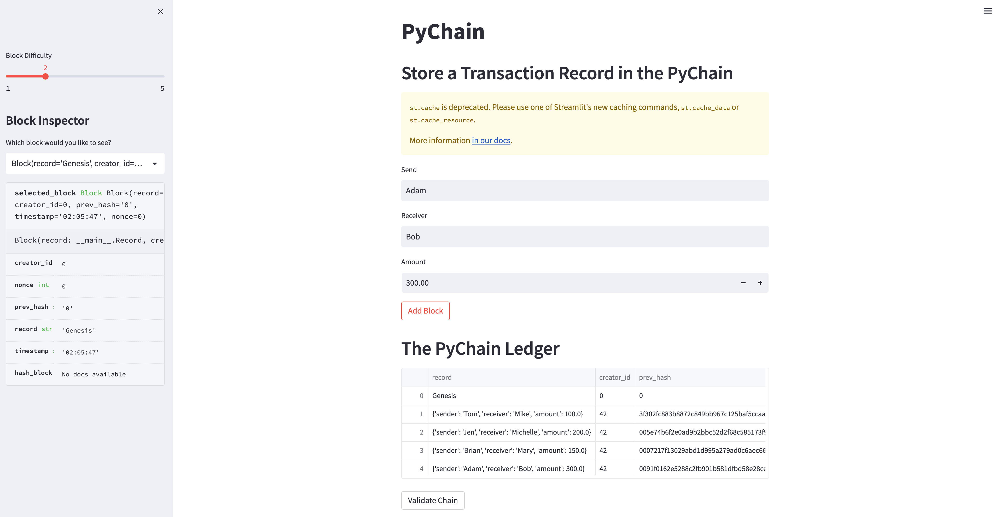
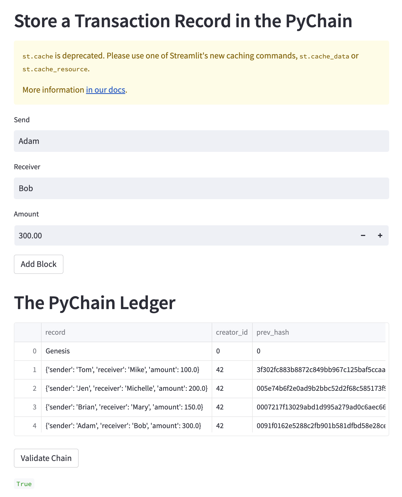

# PyChain Ledger

In this project, I built a blockchain-based ledger system, complete with a user-friendly web interface. This ledger will allow partner banks to conduct financial transactions (that is, to transfer money between senders and receivers) and to verify the integrity of the data in the ledger.

The completed PyChain ledger and user interface are tested by running the Streamlit application. In this example, I added 4 blocks of transactions records. The details of one block is shown on the sidebar.

I also tested the blockchain validation process by using the web interface. After clicking the `Validate Chain` button, the result shows the chain is valid.

